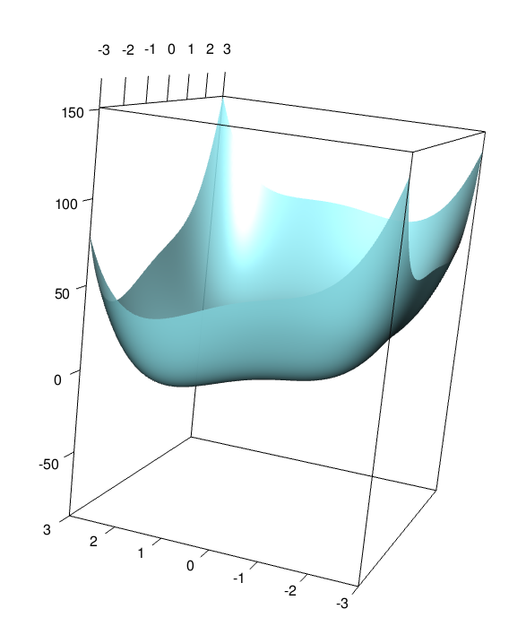

```{r setup, include=FALSE}
## Global options
knitr::opts_chunk$set(
  cache = TRUE,
  prompt = TRUE,
  comment = '',
  collapse = TRUE,
  warning = FALSE,
  message = FALSE)
```

## Q1:
*Determine the first derivative of f and encode it in a function called f_prime.*  

**MY SOLUTION:**  
Based on chain rule, the first derivative of $f(x)$ is $$f(x)' = \frac{-2x}{x^2+1}+\frac{1}{3}x^{-\frac{2}{3}}$$. Based on this equation, I write the code below. Certainly, we can use the R-built-in function to get the derivative quickly.
```{r}
f_prime <- function(x) {
  out_ <- (-2*x)/(x^2 + 1) + (1/3)*(x^(-2/3))
  return(out_)
}
# since this question requires the maximum, I use -1 times the function.
f_prime_neg <- function(x){
  out_ <- (-2*x)/(x^2 + 1) + (1/3)*(x^(-2/3))
  out_ <- out_*(-1)
  return(out_)
}
```  

## Q2:
*Create a plot of f and f on [0,4] in different colors and line types and add a legend.*  
**MY SOLUTION:**  
```{r}
# write the original function with the name of f_
f_ <- function(x){
  out_ <- (-1)*log(x^2 + 1) + x^(1/3)
  return(out_)}
# since this question requires the maximum, I use -1 times the function.
f_neg <- function(x){
  out_ <- (-1)*log(x^2 + 1) + x^(1/3)
  return(out_*(-1))}

# first plot the original function
x <- seq(0,4,0.01)
# plot the original function with blue line
plot(x, f_(x), col="blue", type = "l", ylim = c(-1.5,1))
# plot the first derivative with red line
lines(x, f_prime(x), col="red", type = "l")
# add the legend
legend(3,1, inset = 0.1, c("f_","f_prime"), lty = 1, 
       col = c("blue","red"), title="Line Type")
# add a horizontal line to indicate the y=0
abline(h=0,lty=3)
abline(v=0.3683525,lty=3)
mtext("Figure 1. The Lines of the Given Function and it's First Derivative",
      side = 3,
      line = -2,
      outer = T)
```

## Q3:
*Finish the functions that I started in the R code notes for univariate optimization for the golden section search, the bisection method, and Newton’s method.*   

**MY SOLUTION:**  

### 3.1 The Golden Section Search  
```{r}
golden <- function(f, int, precision = 1e-6)
{
  rho <- (3-sqrt(5))/2 # ::: Golden ratio
  # ::: Work out first iteration here
  f_a <- f(int[1] + rho*(diff(int)))
  f_b <- f(int[2] - rho*(diff(int)))
  ### How many iterations will we need to reach the desired precision?
  N <- ceiling(log(precision/(diff(int)))/log(1-rho))
  for (i in 1:(N))                    # index the number of iterations
  {
    if (f_a < f_b)  
    {
      int[2] <- int[2] - rho*(diff(int))
      f_b <- f(int[2])
    } else{
      if (f_a >= f_b)
      {
        int[1] <- int[1] + rho*(diff(int))
        f_a <- f(int[1])
      } }
  }
  int
  print(paste0("Iteration for ",N," times;",
               " The maximum value is at", round(int[1],6)))
}
```  

### 3.2 The Bisection Method  
More information about this method can be found on *Page 116* of Chong and Zak (2013).
```{r}
bisection <- function(f_prime, int, precision = 1e-7)
{
  # ::: f_prime is the function for the first derivative
  # ::: of f, int is an interval such as c(0,1) which 
  # ::: denotes the domain
  
  N <- ceiling(log(precision/(diff(int)))/log(.5))
  # find the midpoint of the initial uncertainty range
  midpoint <- (int[1]+int[2]) /2
  # evaluate the f_prime on the midpoint
  f_prime_a <- f_prime(midpoint)
  i <- 1
  for (i in 1:N)
  {
    i <- i + 1
    if(f_prime_a < 0)
    {
      # if the f_prime on the midpoint is less than 0,
      # the minimizer must be on the right side of midpoint.
      int[1] <- midpoint
      # update the uncertainty range
      midpoint <- (int[1]+int[2]) /2
    } else
      if(f_prime_a > 0)
      {
        # if the f_prime on the midpoint is less than 0,
        # the minimizer must be on the left side of midpoint.
        int[2] <- midpoint
        midpoint <- (int[1]+int[2]) /2
      } else
        if(f_prime_a == 0)
        {
          break
        }
    # ::: FILL IN CODE HERE (UPDATE)
    f_prime_a <- f_prime(midpoint)
  }
  int
  print(paste0("Iteration for ",N," times;",
               " The maximum value is at ", round(int[1],6)))
}
```

### 3.3 The Newton's Method   
More information about this method can be found on *Page 116* of Chong and Zak (2013).
```{r}
newton <- function(f_prime, f_dbl, precision = 1e-6, start)
{
  x_old <- start
  x_new <- x_old - f_prime(x_old)/f_dbl(x_old)
  
  i <- 1
  print(paste0("Iteration ", i, "; Estimate = ", x_new) )
  while (abs(x_new-x_old) > precision){
    x_old <- x_new
    x_new <- x_old - f_prime(x_old)/f_dbl(x_old)
    # ::: redefine variables and calculate new estimate
    # ::: keep track of iteration history
    print(paste0("Iteration ", i+1, "; Estimate = ", x_new) )
    i <- i + 1
  }
  x_new
}
```  

## Q4:
*Apply each of the three functions to this example to discover the minimum. Keep track of and report the number of iterations required for each method. Report the coordinates of the minimum discovered by each of the three functions as well as the number of iterations required*   

**MY SOLUTION:** 

### 4.1 Apply the Golden Section Search
```{r}
golden(f_neg, c(0,4))
```   

### 4.2 Apply the Bisection Method
```{r}
bisection(f_prime_neg, c(0,4))
```  

### 4.3 Apply the Newton's Method  
First, I need to get the second derivative of the original function. Based on the Quotient Rule and Chain Rule, one can easily have $$f(x)''= -6x^2-2-\frac{2}{9}x^{-\frac{5}{3}}$$
```{r}
# write the second derivative function
f_dbl <- function(x){
  out_ <- -6*x^2-2-(2/9)*x^(-5/3)
  return(out_)
}
# since this question requires the maximum, I use -1 times the function.
f_dbl_neg <- function(x){
  out_ <- -6*x^2-2-(2/9)*x^(-5/3)
  return(out_*(-1))
}
```  
Plug the first and the second derivatives into the Newton's Method function.
```{r}
newton(f_prime_neg, f_dbl_neg,start = 1)
```  
All three methods have the identical results, that is the maximum point of the given function is at $x=.368352$, as shown in `Figure.1`. As for the iteration times at the x interval $[0,4]$, the Golden Section Search iterated 32 times; the Bisection Method iterated 26 times. However, Newton's method iteration time largely depends on the start numbers. That is, the more guessing number close to the target, the less times needed.  

## Q5:
*Did the methods perform as you expected in terms of the number of iterations? Why or why not?*   

**MY SOLUTION:**  

Yes. The bisection method has larger "step" than golden search method, therefore, the search iteration should be more efficient for bisection method. However, Newton's method iteration time largely depends on the start numbers. That is, the more guessing number close to the target, the less times needed.  

## Q6:
*Use function persp3d() in package rgl to plot function f on [-3,3]....*   

**MY SOLUTION:**  
I write the function first.
```{r}
# write the function
f_bi <- function(x_1, x_2){
  out_ <- x_1^4 + x_2^4 - 2*x_1^2 + 2*x_1*x_2 - 3*x_2^2 + 6*x_1 - 4*x_2 + 10
  return(out_)
}
```  
Then, plot the 3-d surface of function.
```{r,fig.show='hold',out.width="70%",out.height= "50%"}
library(rgl)
# Define grid for plotting
x = seq(-3, 3, by = .05)
y = seq(-3, 3, by = .05)
xy <- expand.grid(x,y)

# Calculate height of function
# xy[,1] is vector of 'x' values; xy[,2] is vector of 'y' values
z <- mapply(FUN = f_bi, xy[,1], xy[,2])

### Plot the surface over the domain
plot3d(xy[,1], xy[,2], z, type = "n", radius = 1.5, 
       col = "cadetblue1", zlim = c(-90, 90), xlab = "", 
       ylab = "", zlab = "")
surface3d(x, y, z = matrix(z,length(x)), col = "cadetblue1", 
          zlim = c(-90, 90), alpha = .9)

```  

From the 3D plot, I guess the minimum point is around (-2.1, 1.8, -11). 

## Q7:
*Find the partial derivatives of f with respect to x1 and x2 and write a function called grad_f() that gives the gradient of f.*   

**MY SOLUTION:**  
```{r}
# write the original function
f_origin <- function(x_1, x_2){
  out_ <- x_1^4+x_2^4-2*x_1^2+2*x_1*x_2-3*x_2^2+6*x_1-4*x_2+10
  return(out_)
}

# write the two partial derivatives
dfdx_1 <- function(x_1, x_2){
  return(4*x_1^3-4*x_1 + 2*x_2+6)
}
dfdx_2 <- function(x_1, x_2){
  return(4*x_2^3+2*x_1-6*x_2-4)
}

# write the gradient descent function
grad_f <- function(x_1, x_2){c(dfdx_1(x_1,x_2), dfdx_2(x_1,x_2))}
```  

## Q8:
*Write a function to implement gradient ascent with arguments for the start point, the number of iterations, the step size alpha...*   

**MY SOLUTION:**   
Here, we need to discuss about the necessity of normalized gradient. Intuitively, if each time we normalize the gradient, the length of "step size" for updating is fixed. That is, the value of $Learning\_Rate*Gradient's\_Unit\_Vector$. Apparently, it is a fixed rather than dynamic value to update the $x_1$ and $x_2$ coordination. Therefore, one can easily see the final steps will always oscillate around the target point and the stop criterion might never be reached! I choose to skip the `normalize` step, and use the $Learning\_Rate*Gradient$ directly as a dynamic updating value to avoid the oscillation. That is, the closer to the target point, the smaller the step size.
```{r}
gradient_d <- function(f_original, # the original function
                       grad_f, # the gradient function
                       start_point, # the start point, a vector
                       max_iter=100, # the maximum number of iteration
                       alpha=0.03, # learning rate/ step size
                       epsilon=1e-5 # stopping criterion
){
  # initial settings
  p_old <- start_point;i <- 1;check <- 1
  while (check > epsilon) {
    # print the iteration information at each 10 rounds
    # if (i ==1 | i%%5 == 0){
    #  print(paste0("Iter ", i, "; f(x_1, x_2)= ", f_original(p_old[1], p_old[2])))}
    print(paste0("Iter ", i, "; f(x_1, x_2)= ", f_original(p_old[1], p_old[2])))
    # Stop condition and warning
    if (i > max_iter) {
      print("Exceed maximum number of iterations")
      break
      }
    if (abs(p_old[1]) > 3 |abs(p_old[2] >3)) {
      print("Exceed the Given Range")
      break
      }
    # load the gradient
    gradient_ <- grad_f(p_old[1], p_old[2])
    # As discussed above, I choose to not use the normalized gradient here
    # gradient_norm <- gradient_/sqrt(gradient_%*%gradient_)
    # update the point coordination with gradient * learning rate
    p_new <- p_old - alpha*gradient_
    # check the updating rate of p_new, if less than epsilong, stop
    check <- sqrt((p_new-p_old)%*%(p_new-p_old))/ sqrt(p_old %*% p_old)
    # redefine the old point to send for next updating 
    p_old <- p_new
    i <- i + 1
  }
  print(paste0("The minimum point is around ", 
               round(p_old[1],4)," ",
               round(p_old[2],4)," ",
               round(f_original(p_old[1],p_old[2]),4)))
}
```
Then, try this gradient descent method on the given function.  
```{r}
gradient_d(f_origin, grad_f, c(1,2))
```  
For text space concern, I choose to print the iteration information at each 10 rounds.The final result shows that the minimum point is around (-1.5711, 1.6143, -10.827), which is close to the observed possible minimum point (-2.1, 1.8, -11) (in my response to Question 6).

## Q9:
*Discuss what changes would need to be made to the gradient ascent function to im- plement steepest ascent. You do not need to actually implement steepest ascent here but you can do so for bonus points.*   

**MY SOLUTION:**   
To find the steepest "step" for updating, we need to introduce the adaptive learning rate $\alpha$. I write some my intuitive understanding here. Since space over 3 dimensions is hard to imagine, I take the 3-d space for discussion with the function of $f(x_1,x_2)$. In this space, any pair of $x_1, x_2$ can construct a plane at the height of $f(x_1,x_2)$. To find the best learning rate at the point $x_1, x_2$ is to find the best direction that minimized the $f(x_1',x_2')-f(x_1,x_2)$. Why minimized? At vertical direction, the steepest direction occurs at the orthogonal distance between two planes. In other words, the orthogonal distance is the minimum value of $f(x_k-\alpha*\nabla f(x_k))$, like discussed in Prof. Keller's in-class notes. Based on thie principle, I refer to the code that Prof. Keller provided in the notes. Here, I have the following syntax. Note, I **insist** to use the non-normalized gradient directly to avoid the oscillation (non-convergence), as discussed in my response to Q8. 

Finally, the iteration time for the steepest descent method is 8, much less than the previous method with 18 iterations.
```{r}
gradient_dynamic <- 
  function(f_original, # the original function
          grad_f, # the gradient function
          start_point, # the start point, a vector
          max_iter=500, # the maximum number of iteration
          alpha=0.03, # learning rate/ step size
          epsilon=1e-5, # stopping criterion
          minimize=TRUE
){
  # initial settings
  p_old <- start_point;i <- 1;check <- 1
  while (check > epsilon) {
    # print the iteration information at each 10 rounds
    # if (i ==1 | i%%5 == 0){
    #  print(paste0("Iter ", i, "; f(x_1, x_2)= ", f_original(p_old[1], p_old[2])))}
    print(paste0("Iter ", i, "; f(x_1, x_2)= ", f_original(p_old[1], p_old[2])))
    # Stop condition and warning
    if (i > max_iter) {
      print("Exceed maximum number of iterations")
      break
    }
    if (abs(p_old[1]) > 3 |abs(p_old[2] >3)) {
      print("Exceed the Given Range")
      break
    }
    # load the gradient
    gradient_ <- grad_f(p_old[1], p_old[2])
    # As discussed above, I choose to not use the normalized gradient here
    # gradient_norm <- gradient_/sqrt(gradient_%*%gradient_)
    # update the point coordination with gradient * learning rate
    
    # -----------------Add the steepest descent---------------------
    if(minimize) { f_min <- function(alpha) { 
      p_temp <- p_old - alpha*gradient_
      f_original(p_temp[1], p_temp[2]) } 
      alpha <- optimize(f_min, interval = c(0, 1), maximum = FALSE)$minimum 
      p_new <- p_old - alpha*gradient_}
    if(!minimize) { f_max <- function(alpha) { 
      p_temp <- p_old - alpha*gradient_
      f_original(p_temp[1], p_temp[2]) } 
      alpha <- optimize(f_max, interval = c(0, 1), maximum = TRUE)$maximum 
      p_new <- p_old - alpha*gradient_}
    # check the updating rate of p_new, if less than epsilong, stop
    check <- sqrt((p_new-p_old)%*%(p_new-p_old))/ sqrt(p_old %*% p_old)
    # redefine the old point to send for next updating 
    p_old <- p_new
    i <- i + 1
  }
  print(paste0("The minimum point is around ", 
               round(p_old[1],4)," ",
               round(p_old[2],4)," ",
               round(f_original(p_old[1],p_old[2]),4)))
}

gradient_dynamic(f_origin, grad_f, c(1,2),minimize = T)
```

## Reference  
This homework is finished by Chenguang Pan and Seng Lei with enthusiasm for statistical learning methods. We refer to Prof. Keller's in-class note and the text book. No AI assistance is used at all. Thank you for your time.


