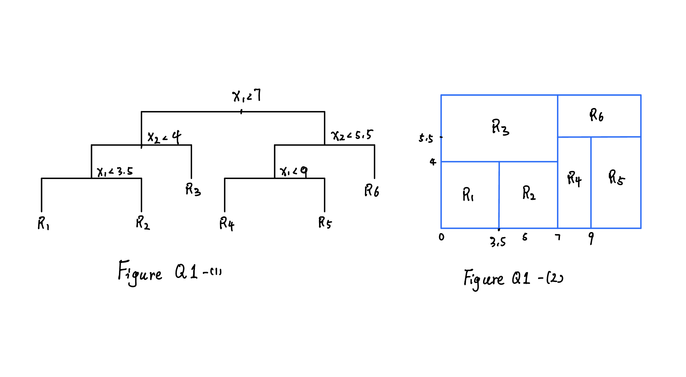
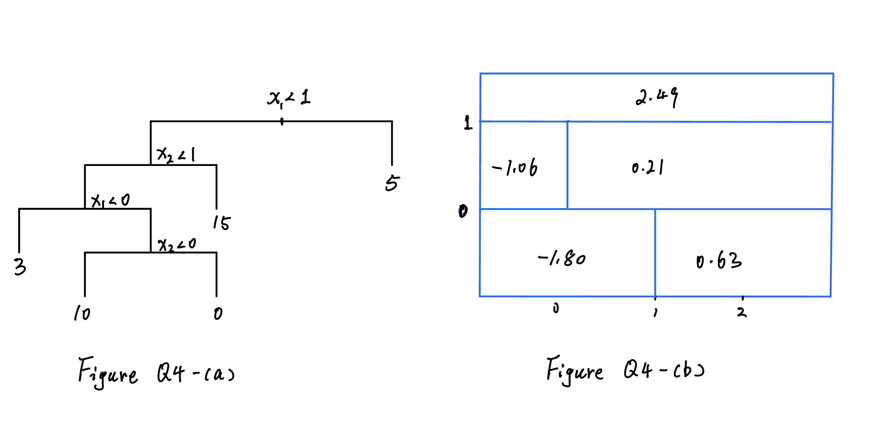

```{r setup, include=FALSE}
## Global options
knitr::opts_chunk$set(
  cache = TRUE,
  prompt = TRUE,
  comment = '',
  collapse = TRUE,
  warning = FALSE,
  message = FALSE)
```   

1, 4, 5, 6, and 8 (a) - (c).

## 1.0 ISLR_Chapter 8 Q1  
*Draw an example (of your own invention) of a partition of two- dimensional feature space that could result from recursive binary splitting....*  

**MY SOLUTION**  

 


## 2.0 ISLR_Chapter 8 Q4  

*This question relates to the plots in Figure 8.14*

**MY SOLUTION**  

  


## 3.0 ISLR_Chapter 8 Q5  

*Suppose we produce ten bootstrapped samples from a data set containing red and green classes....*

**MY SOLUTION**  

For the majority vote method, the class would be red if the probability is greater than 0.5. Therefore, I counted the number of that, which is 6. Six out of ten predictions indicate that it is the red. Therefore, it should belong to the red class.  

Next, the average probability is 0.45, which is lower than 0.5. Based on this method, it should be green.  


## 4.0 ISLR_Chapter 8 Q6  

*Provide a detailed explanation of the algorithm that is used to fit a regression tree....*  

**MY SOLUTION**  
I seperate the regression tree algorithm into three main stages:  

*Stage 1: Tree Growing Stage*  

For the regression tree algorithm, one should use the greedy approach (i.e., recursive binary splitting) to find the best partitioning point across all data point to split the data into two regions such that the reduction of RSS is the largest.  

We repeat this method on each separated region until each terminal node has fewer than some minimum number of observations.  

*Stage 2: Post-pruning*  

Apply the cost complexity pruning to the large tree in order to get a sequence of best sub-trees, as a function $\alpha.$  

*Stage 3: CV to find the tuning parameter*  

Use K-fold CV to choose $\alpha.$ Split the training dataset into K folds and repeat the Stage 1 and 2 on all but the Kth fold. Evaluate the mean squared prediction error on the data in the left-out Kth fold, as a function of$\alpha.$  

Average the results for each value of $\alpha$, and pick $\alpha$ to minimize the average error.  

Return the tree calculated using the formula laid out in step 2 on the entire dataset with that chosen value of $\alpha$.  

## 5.0 ISLR_Chapter 8 Q8  

*We will seek to predict Sales using regression trees and related approaches, treating the response as a quantitative variable.*  

### 5.a  

*(a) Split the data set into a training set and a test set.*  

**MY SOLUTION**  
Here I decided to choose 60% of the original dataset as a training part. For the description of the dataset, please see p119 of ISLR2 for more details.   
```{r}
# import the data
library(tree)
library(ISLR2)
df <- Carseats

# randomly select 60% of the original dataset to be the training. 
train_index <- sample(1:nrow(df),nrow(df)*0.6)  
df_train <- df[train_index,]
df_test <- df[-train_index,]
dim(df_train)
dim(df_test)
```  
This separated datasets look good.  

### 5.b  

*(b) Fit a regression tree to the training set. Plot the tree, and interpret the results. What test MSE do you obtain?*  

**MY SOLUTION**  
```{r}
# fit the model on the training dataset 
model_tree <- tree(Sales~., df_train)
summary(model_tree)
```  
Next, plot the tree.  
```{r}
plot(model_tree)
text(model_tree, cex=0.5,pretty=0)
```  
The plot reveals that the `ShelveLoc` variable has a significant impact on car seat sales. Stores with good shelve locations tend to have higher sales compared to those with medium or bad shelve locations. Additionally, the plot suggests that price plays a crucial role in customer behavior as they appear to be price-sensitive. Specifically, lower prices are associated with higher sales.  

Next, to get the MSE.  
```{r}
model_pred <- predict(model_tree, newdata=df_test)
(mse_ <- round(mean((model_pred-df_test$Sales)^2),3))
```  
The MSE is `r mse_`.


### 5.c  

*(c) Use cross-validation in order to determine the optimal level of tree complexity*  

**MY SOLUTION**  

```{r}
model_cv <- cv.tree(model_tree)
# par(mfrow=c(1,2))
plot(model_cv$size, model_cv$dev, type = "l")
```  
Note, the function `cv.tree()` returns the `dev` to represent the error rate and the `k` to indicate the tuning parameter $\alpha$. From the results, the 6 is the best size.  

```{r}
model_prune <- prune.tree(model_tree, best = 6)
plot(model_prune)
text(model_prune, cex=0.5,pretty=0)
```  

```{r}
model_prune_pred <- predict(model_prune, newdata=df_test)
(mse_2 <- round(mean((model_prune_pred-df_test$Sales)^2),3))
```  

This time, the pruned model make the MSE worse. The MSE for pruned tree is `r mse_2`, and for the unpruned tree is `r mse_`.


